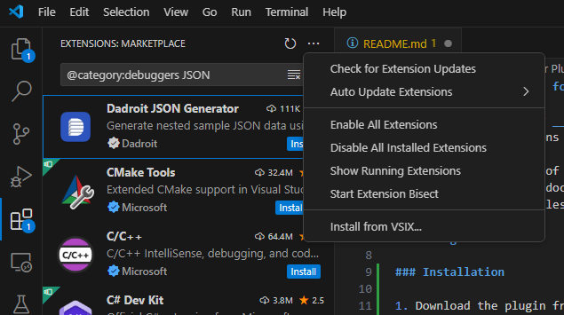
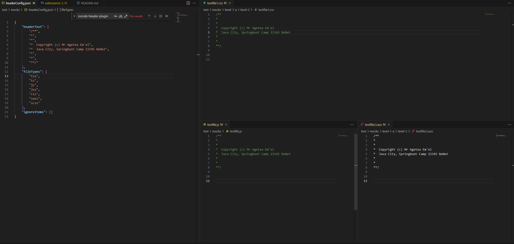

# Simple Header Plugin for VSCode - v1.0.0

The plugin recursively __loops through folders within an open workspace__ and applies textblocks to targetted files, taking exceptions into account if any.

While there are a lot of plugins out there for this purpose, surprisingly most of them seem not to be functional nor straight forward with documentation - thus the reason I created this for my own needs (adding a copyright notice to a large batch of files in my other projects...)

## Geting started

### User Requirements

- Visual Studio Code, version 1.75 or later.

### Installation

1. Download the plugin from (.vsix file listed in the release page) from this repository. 
2. Open Visual Studio Code and go to the Extensions view
3. Click __Views and More Actions__
4. Select __Install from VSIX...__ and select the .vsix file you downloaded.

<p align="center">
    
</p>

### Config

1. Open your workspace's (project) root directory in VSCode
2. Create a file **headerConfig.json** in your workspace directory. E.g. __D:\my-files\my-project\headerConfig.json__


4. Place this code block into the JSON-file and save

```
{
    "startDir": ["D:/vscode-header-plugin/src"],
    "headerText": [],
    "fileTypes": [],
    "ignoreItems": []
}
```

## Explanation of headerConfig.json

This file is the foundation of the plugin. Edit it accordingly to your need before running (see instructions below) the plugin.

### startDirs (string[], optional)
The directories of the files you wish to prepend a textblock to (defaults to the workspace's root folder if not present). Files within all levels of subfolders are taken into consideration. Only specify folders relevant to your project. Careless use may mess up your system

### headerText (string[])
Chunks of strings that makes up the textblock you wish to prepend. E.g.

```
    [
        "/**",
        "*",
        "*",
        "*  Copyright (c) Mr Agetea Em'el",
        "*  Java City, Springboot Camp 23345 NoNet",
        "*",
        "*",
        "**/"
    ]
```

Should result in the following being prepended to your files:

```
    /**
    *
    *
    *  Copyright (c) Mr Agetea Em'el
    *  Java City, Springboot Camp 23345 NoNet
    *
    *
    **/
```

### fileTypes (string[])
Allow files of certain extensions to have the textblock prepended, e.g. __["tsx", "ts", "js", "jsx", "css", "sass","scss"]__. Other files are ignored. 

### ignoreItems (string[])
A list of paths to specific items to ignore. E.g. __D:/vscode-header-plugin/src/utils/son-goku.js__. Ignoring a folder also means ignoring all files nested in that folder.

## Run
Hit Ctrl + Shift + P and select **Simple Header: Add headers to files** from the command bar. The plugin inserts a textblock based on settings in  __headerConfig.json__ -

### Warning!
Backup and/or commit your project - and make a proper assessment of the **headerConfig.json** file - before running this plugin. Careless use may mess up your project.



## Tests

Preliminary manual tests indicates the plugin works as expected on Windows 10. The plugin has __not been tested in neither Linux nor Mac__ yet, so avoid using it on those systems for now...

Automated tests are located in __/test/__ along with necessary mocks. Currently there are only a very basic tests for certain features. More relevant tests will be added later to ensure high confidence in the plugin truly working as intended.

### Run tests

1. Open the project
2. In the project's terminal, run the following command:

```
    npm run test
```

The results shows up in the terminal once the tests have been completed.

## Todo

- Write tests to thoroughly cover important cases that occurs when changing headerConfig.json
- Configure bundling

# MIT License
This plugin falls under the MIT License (see LICENSE.md). Use it however you like, change it however you like and distribute it however you like. Contributions are appreciated, just keep it simple.
